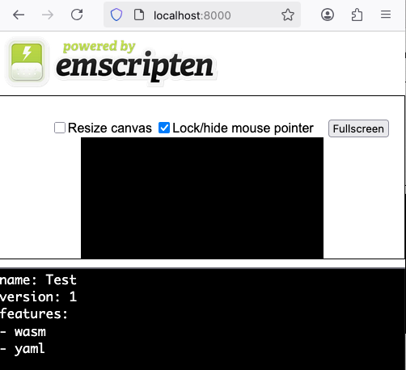

# yaml-cpp-wasm

Example of a WebAssembly application that reads a YAML file

## Native
```shell
make build run
```
output
```yaml
name: Test
version: 1
features:
- wasm
- yaml
```

## Wasm
```shell
make build/wasm run/wasm
```
open http://localhost:8080


